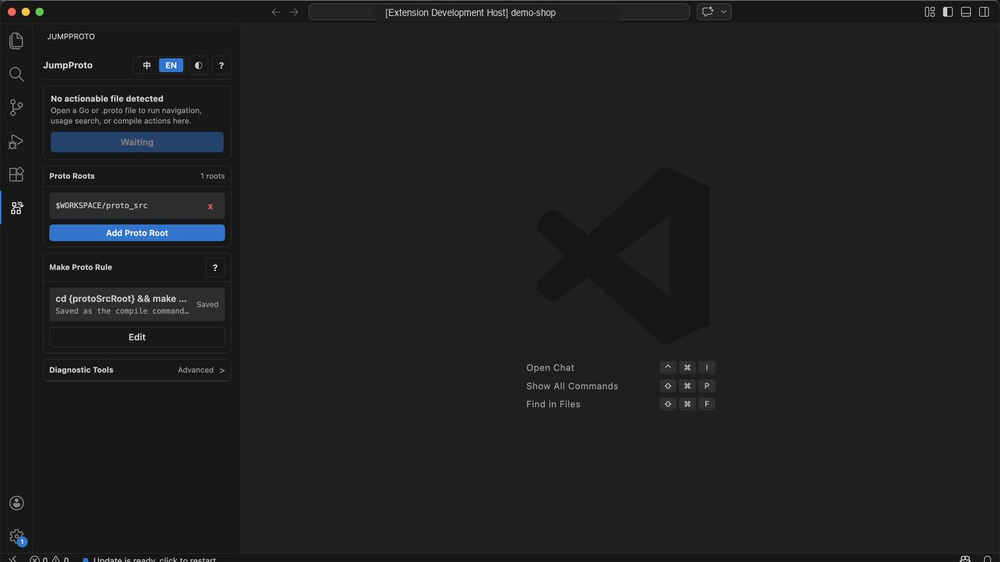
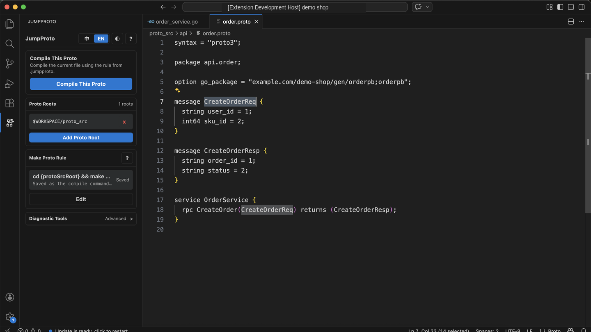
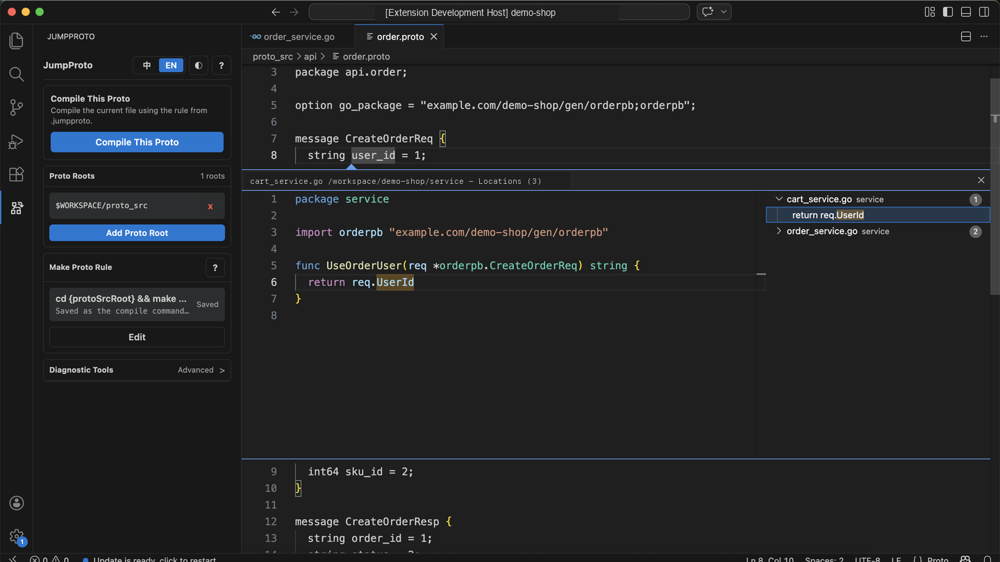

<div align="center">

# JumpProto

### Go ↔ .proto navigation for generated Go projects

[](https://marketplace.visualstudio.com/items?itemName=SivanLiu.jumpproto)
[](https://open-vsx.org/extension/SivanLiu/jumpproto)

[](LICENSE)

English | [简体中文](#简体中文)

</div>

JumpProto helps Go teams move between generated Go code and the source `.proto` files that produced it. It is useful in repositories where `.pb.go` files, services, and Proto sources live in separate directories and the normal definition flow stops inside generated code.

Use JumpProto to:

- jump from generated Go symbols back to `message`, `enum`, `service`, `rpc`, nested messages, and fields in `.proto`;
- find Go usages from a Proto message, enum, RPC, field type, or field name;
- keep project-level Proto roots and compile rules in `.jumpproto`;
- run or dry-run the current Proto compile command from the sidebar;
- diagnose stale or unexpected navigation results without leaving the editor.

## Screenshots







## Install

- [Install from Visual Studio Marketplace](https://marketplace.visualstudio.com/items?itemName=SivanLiu.jumpproto)
- [Install from Open VSX](https://open-vsx.org/extension/SivanLiu/jumpproto)

After installation, open a Go workspace that contains generated `.pb.go` files and source `.proto` files.

## Quick Start

1. Open the JumpProto view from the Activity Bar.
2. Add the directory that contains source Proto files, for example `proto_src`.
3. Open a generated Go file and place the cursor on a generated symbol such as `CreateOrderReq`.
4. Press `F12`, or run `JumpProto: Jump To Proto`.
5. Open a `.proto` file and run `JumpProto: Jump To Go` on a message, field, enum, service, or RPC when you need Go usages.

If your team wants shared project setup, commit a `.jumpproto` file at the workspace root.

## Main Workflows

### Go To Proto

JumpProto follows the generated Go definition, reads the generated file header, and opens the matching source `.proto` file.

```go
// generated order.pb.go
// source: api/order.proto

type CreateOrderReq struct {
    UserId string `protobuf:"bytes,1,opt,name=user_id,json=userId,proto3"`
}
```

Put the cursor on `CreateOrderReq` or `UserId` in Go, then use `F12` or `JumpProto: Jump To Proto`.

### Proto To Go

From a `.proto` file, JumpProto searches Go code for common usage forms:

- qualified imports, such as `orderpb.CreateOrderReq`;
- import aliases;
- same-package generated Go references;
- field reads, such as `req.UserId`;
- getter calls, such as `req.GetUserId()`;
- composite literal fields, such as `UserId: value`.

Results open in VS Code's native references view.

### Compile Current Proto

Configure a command template once, then run it for the active `.proto` file from the sidebar or command palette.

```bash
cd {protoSrcRoot} && make api pkg={protoFileNoExt}
```

Use `Test Command` before compiling. It performs a shell dry run and writes the rendered command to the `JumpProto` output channel.

## Project Config

JumpProto uses `.jumpproto` at the opened workspace root for project-level configuration. This is the recommended setup for teams because roots and compile rules can be shared with the repository.

```json
{
  "protoRoots": [
    "proto_src",
    "../shared-proto"
  ],
  "searchInWorkspace": true,
  "makeProtoCommand": "cd {protoSrcRoot} && make api pkg={protoFileNoExt}",
  "exclude": [
    "**/node_modules/**",
    "**/vendor/**",
    "**/out/**",
    "**/dist/**",
    "**/.git/**"
  ]
}
```

Relative `protoRoots` are resolved from the workspace root. `.jumpproto` values take priority over older `protoJump.*` VS Code settings; missing fields still fall back to those settings for compatibility.

## Compile Placeholders

| Placeholder | Value |
| --- | --- |
| `{workspaceFolder}` | Current workspace root. |
| `{protoSrcRoot}` | Matched Proto source root. |
| `{protoFile}` | Active Proto file path. |
| `{protoFileNoExt}` | Active Proto file name without `.proto`. |
| `{protoDir}` | Directory of the active Proto file. |
| `{relativeProto}` | Path relative to `protoSrcRoot`, including `.proto`. |
| `{relativeProtoNoExt}` | Path relative to `protoSrcRoot`, without `.proto`. |
| `{protoPackage}` | Package segment inferred from `go_package` or `package`. |

For repositories with multiple compile targets, route by relative path:

```bash
cd {protoSrcRoot} && case {relativeProto} in
  rpc/*) make rpc pkg={protoFileNoExt} ;;
  api/*) make api pkg={protoFileNoExt} ;;
  model/*) make golang_model_proto ;;
  *) make special_proto packagename={protoPackage} filename={protoFileNoExt} ;;
esac
```

## Commands

| Command | What It Does |
| --- | --- |
| `JumpProto: Jump To Proto` | Opens the source `.proto` definition for the generated Go symbol under the cursor. |
| `JumpProto: Jump To Go` | Finds Go usages for the Proto symbol or field under the cursor. |
| `JumpProto: Compile This Proto` | Runs the configured command template for the active `.proto` file. |
| `JumpProto: Test Navigation` | Resolves the current cursor target and writes the result to output. |
| `JumpProto: Diagnose Current Symbol` | Writes detailed navigation diagnostics to output. |
| `JumpProto: Open Output` | Opens the `JumpProto` output channel. |
| `JumpProto: Clear Cache` | Clears JumpProto's in-memory navigation and usage caches. |

The sidebar also provides buttons for Proto roots, Make Proto rules, language switching, theme switching, diagnostics, output, and cache cleanup.

## Requirements

- Generated Go files should be produced by `protoc-gen-go`.
- Generated files should contain a source header such as `// source: api/order.proto`.
- Go-to-Proto navigation works best with the official Go extension and `gopls` enabled.
- Compile commands run locally through the current system shell.

## Limits

- Go-to-Proto navigation depends on VS Code first resolving the Go symbol to a generated `.pb.go` or `.pb.gw.go` definition.
- Proto-to-Go usage search is a static workspace search, not a full Go type-system reference query.
- Usage search returns up to 200 references and can be cancelled from the progress notification.
- Field usage search can miss reflection, dynamic code, generated wrappers, or unusual aliasing.
- JumpProto caches file scans for responsiveness. Cache entries are automatically invalidated on relevant file, config, or workspace changes, and can also be cleared manually from the sidebar.

## Privacy

JumpProto runs locally inside VS Code/Cursor. It does not send paths, source code, Proto files, Go files, or compile commands to any remote service.

Path examples in this README use placeholders such as `/workspace/demo-shop`, `/ABSOLUTE/PATH/TO/...`, and `$HOME/...` to avoid exposing personal local directory information.

## Support

Report issues at [github.com/SivanCola/JumpProto/issues](https://github.com/SivanCola/JumpProto/issues).

## License

JumpProto is licensed under the Apache License, Version 2.0. See [LICENSE](LICENSE). Third-party asset notices are listed in [NOTICE](NOTICE) and [THIRD_PARTY_NOTICES.md](THIRD_PARTY_NOTICES.md).

---

<a id="简体中文"></a>

## 简体中文

JumpProto 帮助 Go 项目在生成后的 Go 代码和源 `.proto` 文件之间来回跳转。它适合 `.pb.go`、业务 Go 代码和 Proto 源码分散在不同目录里的仓库，尤其适合普通定义跳转只停在生成代码里的场景。

你可以用 JumpProto：

- 从生成 Go 符号跳回 `.proto` 里的 `message`、`enum`、`service`、`rpc`、内部消息和字段；
- 从 Proto 的 message、enum、RPC、字段类型或字段名反查 Go 使用处；
- 使用 `.jumpproto` 保存项目级 Proto 根目录和编译规则；
- 在侧边栏运行或 dry-run 当前 Proto 文件的编译命令；
- 在跳转结果异常时查看诊断信息并清理缓存。

## 安装

- [从 Visual Studio Marketplace 安装](https://marketplace.visualstudio.com/items?itemName=SivanLiu.jumpproto)
- [从 Open VSX 安装](https://open-vsx.org/extension/SivanLiu/jumpproto)

安装后，打开包含生成 `.pb.go` 文件和源 `.proto` 文件的 Go 工作区。

## 快速开始

1. 从 Activity Bar 打开 JumpProto 侧边栏。
2. 添加源 Proto 文件所在目录，例如 `proto_src`。
3. 打开生成 Go 文件，把光标放在 `CreateOrderReq` 这类生成符号上。
4. 按 `F12`，或执行 `JumpProto: Jump To Proto`。
5. 打开 `.proto` 文件后，可在 message、字段、enum、service 或 RPC 上执行 `JumpProto: Jump To Go` 查看 Go 使用处。

如果团队需要共享配置，建议把 `.jumpproto` 提交到仓库根目录。

## 主要工作流

### Go 跳 Proto

JumpProto 会跟随生成 Go 定义，读取生成文件头部，再打开对应的源 `.proto` 文件。

```go
// generated order.pb.go
// source: api/order.proto

type CreateOrderReq struct {
    UserId string `protobuf:"bytes,1,opt,name=user_id,json=userId,proto3"`
}
```

把光标放在 Go 里的 `CreateOrderReq` 或 `UserId` 上，然后使用 `F12` 或 `JumpProto: Jump To Proto`。

### Proto 查 Go

从 `.proto` 文件出发，JumpProto 会搜索常见 Go 使用方式：

- 带包名引用，例如 `orderpb.CreateOrderReq`；
- import alias；
- 同包生成 Go 引用；
- 字段读取，例如 `req.UserId`；
- getter 调用，例如 `req.GetUserId()`；
- 结构体字面量字段，例如 `UserId: value`。

结果会打开在 VS Code 原生引用视图里。

### 编译当前 Proto

配置一次命令模板后，即可从侧边栏或命令面板按当前 `.proto` 文件执行。

```bash
cd {protoSrcRoot} && make api pkg={protoFileNoExt}
```

编译前建议先点击 `Test Command`。它只做 shell dry-run，并把展开后的命令写入 `JumpProto` 输出面板。

## 项目配置

JumpProto 推荐使用工作区根目录下的 `.jumpproto` 保存项目级配置。这样团队可以在仓库里共享同一套根目录和编译规则。

```json
{
  "protoRoots": [
    "proto_src",
    "../shared-proto"
  ],
  "searchInWorkspace": true,
  "makeProtoCommand": "cd {protoSrcRoot} && make api pkg={protoFileNoExt}",
  "exclude": [
    "**/node_modules/**",
    "**/vendor/**",
    "**/out/**",
    "**/dist/**",
    "**/.git/**"
  ]
}
```

相对 `protoRoots` 会从工作区根目录解析。`.jumpproto` 优先于旧的 `protoJump.*` VS Code 设置；未声明的字段仍会回退到旧设置，便于兼容已有用户。

## 编译占位符

| 占位符 | 含义 |
| --- | --- |
| `{workspaceFolder}` | 当前工作区根目录。 |
| `{protoSrcRoot}` | 命中的 Proto 源文件根目录。 |
| `{protoFile}` | 当前 Proto 文件路径。 |
| `{protoFileNoExt}` | 当前 Proto 文件名，不含 `.proto`。 |
| `{protoDir}` | 当前 Proto 文件所在目录。 |
| `{relativeProto}` | 相对 `protoSrcRoot` 的路径，包含 `.proto`。 |
| `{relativeProtoNoExt}` | 相对 `protoSrcRoot` 的路径，不含 `.proto`。 |
| `{protoPackage}` | 根据 `go_package` 或 `package` 推导出的包名片段。 |

同一仓库有多套编译目标时，可以按相对路径分流：

```bash
cd {protoSrcRoot} && case {relativeProto} in
  rpc/*) make rpc pkg={protoFileNoExt} ;;
  api/*) make api pkg={protoFileNoExt} ;;
  model/*) make golang_model_proto ;;
  *) make special_proto packagename={protoPackage} filename={protoFileNoExt} ;;
esac
```

## 命令

| 命令 | 作用 |
| --- | --- |
| `JumpProto: Jump To Proto` | 打开光标下生成 Go 符号对应的源 `.proto` 定义。 |
| `JumpProto: Jump To Go` | 查找光标下 Proto 符号或字段的 Go 使用处。 |
| `JumpProto: Compile This Proto` | 按当前 `.proto` 文件上下文运行已配置的命令模板。 |
| `JumpProto: Test Navigation` | 解析当前光标目标并写入输出面板。 |
| `JumpProto: Diagnose Current Symbol` | 将当前光标的详细诊断信息写入输出面板。 |
| `JumpProto: Open Output` | 打开 `JumpProto` 输出面板。 |
| `JumpProto: Clear Cache` | 清理 JumpProto 的内存跳转和 usage 缓存。 |

侧边栏也提供 Proto 根目录、Make Proto 规则、语言切换、主题切换、诊断、输出和清理缓存入口。

## 前置条件

- Go 代码应由 `protoc-gen-go` 生成。
- 生成文件应包含 `// source: api/order.proto` 这类 source 头部。
- Go 跳 Proto 推荐配合官方 Go 扩展和 `gopls` 使用。
- 编译命令会在本机通过当前系统 shell 执行。

## 支持边界

- Go 跳 Proto 依赖 VS Code 先把 Go 符号解析到生成的 `.pb.go` 或 `.pb.gw.go` 定义。
- Proto 查 Go 是静态工作区搜索，不等同于完整 Go 类型系统引用查询。
- Usage 搜索最多返回 200 个引用，可在进度通知里取消。
- 字段使用处搜索可能漏掉反射、动态代码、生成包装或复杂别名。
- JumpProto 会缓存文件扫描以保持响应速度。相关文件、配置或工作区变化时会自动失效，也可以从侧边栏手动清理。

## 隐私

JumpProto 只在 VS Code/Cursor 本地运行，不会把路径、源码、Proto 文件、Go 文件或编译命令发送到任何远程服务。

本文档中的路径示例使用 `/workspace/demo-shop`、`/ABSOLUTE/PATH/TO/...` 和 `$HOME/...` 这类占位符，避免暴露个人本地目录信息。

## 支持

问题反馈请提交到 [github.com/SivanCola/JumpProto/issues](https://github.com/SivanCola/JumpProto/issues)。

## 许可证

JumpProto 使用 Apache License, Version 2.0 授权。详见 [LICENSE](LICENSE)。第三方资源声明见 [NOTICE](NOTICE) 和 [THIRD_PARTY_NOTICES.md](THIRD_PARTY_NOTICES.md)。
